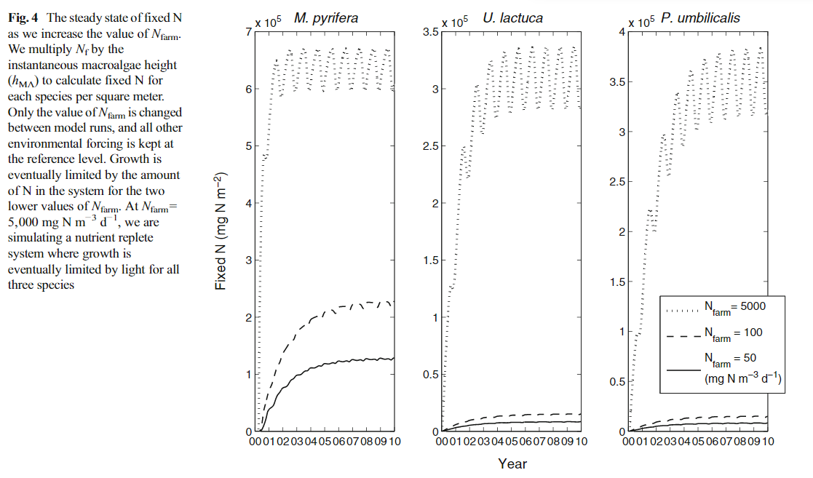

```{r setup, include=FALSE}


options(scipen=999)

knitr::opts_knit$set(root.dir = '../')
source("../hadley_model_test.R", local = knitr::knit_global())


op = function(x, d=0) sprintf(paste0("%1.",d,"f"), x) 


```

```{=tex}

\newcommand{\version}{0.1[DRAFT]}


% farm and MA dimensions %

\newcommand{\zfarm}{\mathrm{z_{farm}}}
\newcommand{\xfarm}{\mathrm{x_{farm}}}
\newcommand{\yfarm}{\mathrm{y_{farm}}}

\newcommand{\dens}{\rho_{\mathrm{farm}}}

\newcommand{\hMA}{h_{MA}}
\newcommand{\wMA}{w_{MA}}

\newcommand{\VMA}{V_{MA}}

% flow and effective volume %

\newcommand{\flow}{F_{in}}
\newcommand{\tz}{t_z}

\newcommand{\Veff}{V_{EFF}}

\newcommand{\SMLD}{h_{SML}}


% state variables and related %

\newcommand{\ammon}{\mathrm{NH_4}}
\newcommand{\ammonext}{\mathrm{NH_{4\_ext}}}


\newcommand{\nitr}{\mathrm{NO_3}}
\newcommand{\nitrext}{\mathrm{NO_{3\_ext}}}

\newcommand{\NXx}{\mathrm{NX_x}}

\newcommand{\Ns}{\mathrm{N_s}}
\newcommand{\Nf}{\mathrm{N_f}}

\newcommand{\phos}{\mathrm{PO_4}}
\newcommand{\phosext}{\phos_{\mathrm{ext}}}
\newcommand{\NP}{\mathrm{N:P_{MA}}}


\newcommand{\D}{\mathrm{D}}
\newcommand{\rl}{r_{L}}
\newcommand{\Kd}{K_{d}}
\newcommand{\rlD}{\rl\cdot\D}
\newcommand{\rN}{r_{N}}
\newcommand{\rnN}{\rN\cdot\ammon}

\newcommand{\dm}{d_{M}}

\newcommand{\dmNf}{\dm\cdot\Nf}
\newcommand{\dmNs}{\dm\cdot\Ns}
\newcommand{\VNXx}{V_{\NXx}}

\newcommand{\VNHfour}{V_{\ammon}}
\newcommand{\VNOthree}{V_{\nitr}}

\newcommand{\KNHfour}{K_{\ammon}}
\newcommand{\KNOthree}{K_{\nitr}}


\newcommand{\KNXx}{K_{\NXx}}
\newcommand{\Q}{Q}
\newcommand{\B}{B}

\newcommand{\Qmax}{\Q_{\mathrm{max}}}
\newcommand{\Qmin}{\Q_{\mathrm{min}}}
\newcommand{\gE}{g_{E}}
\newcommand{\gQ}{g_{Q}}
\newcommand{\gT}{g_{T}}
\newcommand{\gEQT}{g(E,Q,T)}
\newcommand{\Kc}{K_{c}}
\newcommand{\T}{\mathrm{T}}
\newcommand{\To}{\T_\mathrm{o}}
\newcommand{\Tmax}{\T_{max}}
\newcommand{\Tmin}{\T_{min}}
\newcommand{\Tx}{\T_x}
\newcommand{\dord}{d_{ord}}
\newcommand{\Isurf}{I_{surf}}
\newcommand{\Itop}{I_{top}}
\newcommand{\Iavg}{I_{avg}}
\newcommand{\Isat}{I_{sat}}
\newcommand{\acs}{a_{cs}}


\newcommand{\perday}{\mathrm{d}^{-1}}
\newcommand{\perdw}{\mathrm{g}^{-1}\mathrm{(dw)}}
\newcommand{\percubicm}{\mathrm{m}^{-3}}
\newcommand{\degc}{^{\circ}}
\newcommand{\parunits}{\mu\mathrm{mol\ m}^{-2}\mathrm{ s}^{-1}}
\newcommand{\Nconcnunits}{\mathrm{mg\ m}^{-3}}
```
This is version  $\version$ of the document

# Background

## Scope and design philosophy

The model is required by the funder to predict the potential yield of macroalgae from European waters on a 1x1km grid. The funder wishes for the assessment of 3 different species of macroalage and requires (external to this model) to ensure that the downstream effects of nutrient utilisation are accounted for in terms of productivity of downstream seaweed farms.

This model is designed to run independently from any geospatial dynamics or interactions which will be handled at the next level up in the software stack being built to meet the requirements of the project.

The model is designed to be flexible enough to be run as a single macroalgal farm 'sub-unit' e.g. 1x1m horizontal extent in a nested multi-scale model of a farm in order to investigate within-farm nutrient and productivity dynamics as may be required. However it is envisaged that the model will be run once for each 1x1 km grid square, with a simple farm density scaling parameter to represent the reality that seaweed farms cannot occupy the entirety of a 1x1km grid square, but may be more productive spread out over an area rather than intensively farmed in one compact unit. Beyond this, as the funder wishes for 'potential' yield the model will not consider practical aspects of limits to seaweed production (distance from coast, maximum possible harvesting frequency, line density, conflicts with other uses of the sea etc.) as these are out of scope. Similarly the effect of grazing, bacterial or viral pressure on macroalgal productivity or the potential impacts of storms or harmful algal blooms are not considered with the scope of this model (although some of these may be identified as risk factors for aquaculture activities within the geospatial framework that this model will operate).

The model is driven by nutrient inputs, light and temperature and is sufficiently simple that it is possible to represent the behaviour of any species of macroalgae by parameter modification without changing the model code. It is derived from a recent simple multi-species model of macroalgal growth by @Hadley2015.

# Model description

    

## Model equations {#model}


The model presented here is based on the model of @Hadley2015, which follows @Aldridge2009 and further @Solidoro1997. The model currency is nitrogen, with 2 inorganic forms, ammonium ($\ammon$) and nitrate ($\nitr$) in water. Algae are able to take up these into a store ($\Ns$) for conversion into fixed nitrogen ($\Nf$), i.e. biomass nitrogen. These 4 nitrogen pools (all with units of mg N m$^{-3}$), plus Detritus, D in g dw m$^{-3}$are the state variables of the model. An additional teschnical state variable , Yield, tracks the quantity of macroalgal material harvested (detailed in Section \@ref(harvest)) 

### Farm dimensions and nutrient supply {#farm}

A farm (Fig. \@ref(fig:farm)) is described by its horizontal and vertical dimensions. Horizonal dimensions are aligned to a notional flow direction, where $\xfarm$ and $\yfarm$ are the sizes of the farm in the flow direction and perpendicular to the flow direction, respectively. For the current application these would normally be fixed at the size of the grid box (1000m). A farm density term, $\dens$, defines the proportion of the total farm area where seaweed is growing (to account for spacing between lines or cages, plus space for access or the transit of other marine craft through the farm area). Typically this value should be no greater than 40% [@vanderMolen2018]. In order to maximise nutrient availabilty, macroalgal lines are assumed to extend to the full width of the farm perpendicular to flow ($\yfarm$) with notional spacing between lines in the x direction allowing for a density < 1.


The cultivation depth, $\zfarm$ is defined as the distance from the water surface to the base of the seaweed. The volume of macroalgae within the the farm is given by:


```{=tex}
\begin{equation}
    \displaystyle
    \VMA=\yfarm\cdot\xfarm\cdot\dens\cdot\hMA (\#eq:VMA)
\end{equation}
```

Where $\hMA$ is the height of the macroaglae (a fixed, species specific parameter). 

The water within the farm volume, extending to the water surface, is considered to be well mixed in all cases. However, the flow of water through the farm horizontally by advection and via vertical mixing introduces new water (and therefore nutrients), affecting both the available concentration of nutrient to drive macroalgal growth and the resulting effect of such growth on the water concentration. Given input terms of horizonal advective flow, $\flow$, and vertical mixing term, $\tz$ (both in length units), an effective volume of influence, $Veff$ can be defined as:

```{=tex}
\begin{equation}
    \displaystyle
    \Veff = \yfarm\cdot(\xfarm+\flow)\cdot(\zfarm+\tz) (\#eq:Veff)
\end{equation}
```

The ratio $\frac{\VMA}{\Veff}$ is used to scale the nutrient uptake within the farm to the net effect on concentration within the effective volume of water. 

We assume that the water column is well mixed to depth $\tz$.  As nutrient flow will tend to restore nutrient concentration back to the ambient concentration, the ratio of advective flow to farm length in the direction of flow  ($\frac{\flow}{\xfarm}$) can be used to determine the nutrient concentration restoration rate to the farm volume,with a maximum value of 1 (per timestep).

Ammonium and nitrate concentration in the model are a function of the restoration of nutrients to ambient concentration by the input of new water, their biomass-specific uptake by seaweed ($f(\NXx,Q)\cdot\B$); remineralisation of detrital material, $\rlD$; nitrification of $\ammon$ to $\nitr$ ($\rnN$); and mortality terms, $\dmNs$, which returns stored nitrogen to the ammonium pool and  $\dmNf$,  which produces detrital material, D. 


```{=tex}
\begin{equation}
    \displaystyle
    \frac{d\mathrm{NH_4}}{dt}=\min(1,\frac{\flow}{\xfarm})\cdot(\ammonext-\ammon)+(\rlD  + \dmNs - f(\ammon,Q)\cdot\B - \rnN)\cdot\frac{\VMA}{\Veff} (\#eq:NH4dt)
\end{equation}
```

```{=tex}
\begin{equation}
    \displaystyle 
    \frac{d\mathrm{NO_3}}{dt}=\min(1,\frac{\flow}{\xfarm})\cdot(\nitrext-\nitr)+(\rnN - f(\nitr,Q)\cdot\B)\cdot\frac{\VMA}{\Veff} (\#eq:NO3dt)
\end{equation}
```

In the above equations, B is the drw weight macroalgal biomass in grams per cubic meter, calculated as $\B=\frac{\Nf}{\Qmin}$. The pool of internal nitrogen stored by the macroalgae, $\Ns$ is controlled by the uptake of $\ammon$ and $\nitr$ into the store, the light, temperature and nutrient dependent growth rate (i.e. the uptake from stored inorganic N to fixed biomass N ($\Nf$)) and the mortality term. 

```{=tex}
\begin{equation}
    \displaystyle 
    \frac{d\Ns}{dt}=(f(\ammon,Q)+f(\nitr,Q)).B-min(\mu\cdot\gEQT\cdot\Ns,\phos_{\Veff}\cdot\NP)-\dmNs (\#eq:Ns)
\end{equation}
```

Here, the term $\mu.g(E,Q,T).\Ns$ represents the nitrogen, temperature and light dependent conversion of stored nitrogen to fixed nitrogen (i.e. biomass growth). When the total available phosphate within the effective volume of influence ($\phos_{\Veff}$) is less than the phosphate requirements to support the calculated conversion of $\Ns$ to $\Nf$, growth is limited to this phosphate availability. 

Fixed (biomass) nitrogen, $\Nf$ is then:

```{=tex}
\begin{equation}
    \displaystyle 
    \frac{d\mathrm{N_f}}{dt}=min(\mu\cdot\gEQT\cdot\Ns,\phos\cdot\NP)-\dmNf (\#eq:Nf)
\end{equation}
```

Finally, the detrital pool is determined from the inflow of detrital material, the loss of $\Nf$ due to mortality and the remineralisation of detritus to $\ammon$.

```{=tex}
\begin{equation}
    \displaystyle 
    \frac{d\D}{dt}=\min(1,\frac{\flow}{\xfarm})\cdot(\D_{ext}-\D)+ (\dmNf- \rlD)\cdot\frac{\VMA}{\Veff} (\#eq:D)
\end{equation}
```


### Growth dynamics {#growth}

Uptake from inorganic nutrients into the fixed nitrogen pool, $\Nf$ is controlled by standard Monod / Michaelis Menten kinetics, whereby the uptake is dependent on the maximum specific uptake rate $\VNXx$ per unit biomass, the concentration of $\ammon$ or $\nitr$ and the half-saturation constant for the species of interest ($\KNXx$), scaled between minimum and maximum value by the internal nutrient quota, Q:

```{=tex}
\begin{equation}
    \displaystyle 
    f_\NXx = \frac{\VNXx\cdot\NXx}{\KNXx+\NXx}\cdot\frac{\Qmax-\Q}{\Qmax-\Qmin}
\end{equation}
```

Nitrogen is fixed from the internal nutrient pool to the fixed nitrogen pool through a specific maximum growth rate, $\mu$, scaled by temperature, light and internal nutrient availability. 

```{=tex}
\begin{equation}
    \displaystyle 
    \mu\cdot\gEQT = \mu\cdot\gE\cdot\gQ\cdot\gT
\end{equation}
```

where $\gQ$ scales the maximum growth rate according to the internal nutrient reserves:

```{=tex}
\begin{equation}
    \displaystyle 
    \gQ =  \frac{\Q-\Qmin}{\Q-\Kc} 
\end{equation}
```

The temperature scaling term used by @Hadley2015 only inhibits growth at temperatures below the optimum temperature, $\To$. However, it is well known that macroalgal species growth rate declines also at temperatures above their optimum. Therefore we adapt the scheme of @Martins2002 which has a 'bell curve' temperature dependence.

```{=tex}
\begin{equation}
    \displaystyle 
    \gT =  \mathrm{e}^{-2.3(\frac{\T-\To}{\T-\Tx})^2} 
\end{equation}
```


Where $\Tx=\Tmax$ for $\T>\To$ and $\Tx=\Tmin$ for $\T<\To$.

The light-dependent scaling as described by @Hadley2015 could not be successfully implemented here, possibly due to a reporting error in their paper. We therefore adopt the light scheme of @Zollmann2021, which includes attentuation of light through the water column and due to self-shading by the macroalgae. We further consider the additional length of light path due to solar incidence angle as described in the follow equations. 

The daily maximum angle of incident light is calculated as a function of latitude (L) and ordinal day of the year ($\dord$):

```{=tex}
\begin{equation}
    \displaystyle 
    \theta = 90-L-23.45 cos(\frac{360}{365}\cdot(\dord+10))
\end{equation}
```

The light intensity at the top of the macroalgae is then calculated as:

```{=tex}
\begin{equation}
    \displaystyle 
    \Itop = \Isurf\cdot{}e^{(-\Kd\cdot\frac{\zfarm-\hMA}{sin(\theta)})}
\end{equation}
```

and the mean irradiance throughout the height of the macroalgae, accounting for self-shading is then calculated as:

```{=tex}
\begin{equation}
    \displaystyle 
    \Iavg = \frac{\Itop}{\frac{\Kd\cdot\hMA}{\sin(\theta)}+\frac{\Nf\cdot\acs}{(\sin(\theta))}}\cdot(1-e^{-(\frac{\Kd\cdot\hMA}{\sin(\theta)}+\frac{\Nf\cdot\acs}{(\sin(\theta))})}
\end{equation}
```

 

The growth scaling function $\gE$ is then

```{=tex}
\begin{equation}
    \displaystyle 
    \gE = \frac{Iavg}{\Isat+\Iavg}
\end{equation}
```
 where $\Isat$ is the species specific saturation irradiace value of the macroalgae. 


## model structure and ins/outs

The model is implemented as a series of differential equations,solved in R using the `deSolve` package [@Soetaert2010] in file `macroalgae_model.R` (see Section \@ref(model) ). The same file also contains functions for creating time-varying forcing functions from input data (Section \@ref(forcings)); and functions for managing harvesting of the macroalgae under various management options (Section \@ref(harvest)). 

For testing or other individual runs, the model can be initialised and run using the `run_MA.R` script in the same directory as the model code. When operationalised within the wider modelling environment it will be initialised and run from a python script which will pass boundary forcings, parameter values and run control settings directly to the model and retrieve outputs. 

### Parameter values {#params}

#### Macroaglal species-specific parameters

Species-specific algal parameters are listed in Table \@ref(tab:algaeparams). [NB In a future version of this document we will need to provide justification for parameter value selection for each species - final parameter values to be determined]


```{r algaeparams, echo=FALSE, message=FALSE}
 source("run_MA.R")
source("bantry_run.R")
nicenames<-c("$\\mu$","$\\VNHfour$","$\\VNOthree$","$\\KNHfour$","$\\KNOthree$","$\\Qmax$","$\\Qmin$","$\\NP$","$\\Kc$","$\\To$","$\\Tmin$","$\\Tmax$","$\\Isat$","$\\acs$","$\\dm$","$\\hMA$","$\\wMA$","$\\rl$","$\\rN$")
descriptions<-c('maximum specific growth rate',
                'maximum ammonium uptake rate',
                'maximum nitrate uptake rate',
                'half saturation constant for ammonium',
                'half saturation constant for nitrate',
                'maximum internal nitrogen',
                'minimum internal nitrogen',
                'N to P ratio of macroalgal biomass',
                'half growth constant',
                'optimum growth temperature',
                'minimum temperature for growth',
                'maximum temperature for growth',
                'saturation irradiance',
                'nitrogen-specific shading',
                'mortality rate',
                'height of macralgae',
                'width of macroalgae e.g. on rope',
                'remineralisation rate',
                'nitrification rate')
units<-c("$\\perday$",
         "mg(N) $\\perdw$ $\\perday$",
         "mg(N) $\\perdw$ $\\perday$",
         "mg(N) $\\percubicm$",
         "mg(N) $\\percubicm$",
         "mg(N) $\\perdw$",
         "mg(N) $\\perdw$",
         "-",
         "mg(N) $\\perdw$",
         "$\\degc$C",
         "$\\degc$C",
         "$\\degc$C",
         "$\\mu$mol m$^{-2}$ s$^{-1}$",
         "m$^{2}$ mg(N)$^{-1}$",
         "$\\perday$",
         "m",
         "m",
         "$\\perday$",
         "$\\perday$"         )

algaeparams<-data.frame(parameter=nicenames,description=descriptions,units=units,ulva=as.character(as.numeric(parms_ulva)),saccharina=as.character(as.numeric(parms_saccharina)),alaria=as.character(as.numeric(parms_alaria)))
 knitr::kable(algaeparams, format='latex',escape=FALSE,caption = 'Species specific parameter values for macroalgae, including default values for ulva and alaria ')
 
 
```

### Farm parameters {#farmparams}

Parameter values controlling the dimensions of the farm are summarised in Table \@ref(tab:farmoparams)

```{r farmoparams, echo=FALSE}
  source("run_MA.R")
  parms<-allparams$farm$defaults$default$parameters
  descs<-allparams$farm$parameters_descriptions
  farmoparams<-data.frame(
    parameter=names(unlist(parms)), 
    description=as.character(lapply(descs, `[[`, 1)),
    units=as.character(lapply(descs, `[[`, 2))
  )
   knitr::kable(farmoparams,caption = 'Macroalgae farm parameters')
 
 
```


### Harvesting {#harvest}

The modelled seaweed is harvested in order to quantify the potential yield of the farm. This is an important feature of the model as growth is non-linear with biomass, with light inhibition becoming significant at higher biomass density and so the act of harvesting directly affects productivity. Harvesting in implemented in the model by means of an event fuction transferring biomass nitrgen, $\Ns$ to the Yield state variables, triggered by time-dependent root-finding function controlled by the havesting parameters passed to the model (Table \@ref(tab:harvestoptions)). 

Macroalgae harvesting strategies are varied, depending on species, local conditions and also local traditions or norms, as well as the end-use of the produce (energy, food, specific organic molecules etc) [@Lehahn2016]. These vary from 'cut and come again' harvesting at various frequencies to a single annual harvest in spring after planting in autumn, followed by a 'fallow' period over the summer [@Hadley2015; @aitken2014;]. Typically the reason for the latter strategy is the combination of higher temperatures and grazing pressure leading to little capacity for growth in the summer months. The model is set up with both of these harvesting modes as options and the default parameter values for each harvesting mode are listed in Table \@ref(tab:harvestoptions).

```{r harvestoptions, echo=FALSE}
  source("run_MA.R")

  harvestoptions<-data.frame(
    parameter=names(unlist(allparams$algae$harvest_parameters$Winter_growth)), 
    Spring_harvest=as.character(as.numeric(unlist(allparams$algae$harvest_parameters$Winter_growth))),
    Continuous_harvest=as.character(as.numeric(unlist(allparams$algae$harvest_parameters$CCA))),
    description=as.character(lapply(allparams$algae$harvest_parameters_description, `[[`, 1))
    #units=as.character(lapply(allparams$algae$harvest_parameters_description, `[[`, 2))
  )
   knitr::kable(harvestoptions,caption = 'Harvest parameters')
 
 
```


### Environmental forcings {#forcings}

Environmental forcings can be time-varying or constant and are passed to the model as vectors (for time-varying) or single values (for constant). The model initialisation then creates interpolating forcing functions using the `stats::approxfun` function, allowing the ODE solver to access forcing values at any point in time. For most forcings the value is linearly interpolated  between daily values, [but for advection and vertical mixing focings the values are implemented as constant values for each day THIS IS STILL TO DO!]. 

Table \@ref(tab:forcings) summarises the environmetal forcings expected by the model. 

```{r forcings, echo=FALSE}
forcings<-data.frame(
  forcing = c('PAR',
              'SST',
              '$\\ammonext$',
              '$\\nitrext$',
              '$\\phosext$',
              '$\\Kd$',
              '$\\flow$',
              '$\\tz$',
              '$\\mathrm{D_{ext}}$',
              'theta'),
  description = c('photosythetically active radiation',
                  'sea surface temperature',
                  'ambient NH4 concentration',
                  'ambient NO3 concentration',
                  'ambient PO4 concentration',
                  'light attenuation coefficient in water',
                  'water current flow rate',
                  'vertical mixing length term',
                  'detrital concentration',
                  'solar angle'
                  
                  ),
  units = c('$\\parunits$',
            '$\\degc$C',
                  '$\\Nconcnunits$',
                  '$\\Nconcnunits$',
                  '$\\mu$M',
                  'm$^{-1}$',
                  'm d$^{-1}$',
                  'm',
                  '$\\Nconcnunits$ (N)',
                  '$\\degc$'
                  )
)
knitr::kable(forcings, format='latex',escape=FALSE,caption = 'Environmental forcings to the macroalal model')

```

In order for the model to  deliver harvested yields, it must be run for 2 full years. For the single over-winter deployment this is necessary as we need to run the model over a winter (between years 1 and 2) and in the case of continuous harvesting, the first year can be considered a 'spin up' to give a best estimate of output in year 2. Note we do not suggest that it is possible in reality to deploy a line of seaweed and contrinually harvest biomass from it in all or even some European seas. However, this harvesting strategy approaches something like a maximum theroetical capacity for production of a specific species of macroalgae.   

The model can be run with either daily data for specific years or, preferably for our current application, with 2 identical years of climatology data with representative values of the past decade or so. 

#### Photosynthetically active radiation (PAR) {#par}

The nature of this data means that missing values are not uncommon, particularly in winter months. We therefore substitute data based on modelled clear sky PAR calculated according to the scheme of @Gregg1990. The function `modelled_par` in R script `calc_par.R` calculates daily mean par given latitude using the `atmos` package which implemented the @Gregg1990 model. 

In order to represent PAR after accounting for cloud cover on days where data is absent, we scale the modelled par by a scaling factor randomly sampled from a normal distribution with the mean and standard deviation calculated from the par in observed data for the same location, normalised to the modelled clear-sky PAR. The function `substitute_par` in `calc_par.R` is used to make this data substitution.

```{r substitute_par, messages=FALSE}
source('calc_par.R')
substitute_par
```
Fig \@ref(fig:parsubs) show the output of the data substitution, and highlights the excellent agreement between theoretical and observed celar-sky PAR.   

```{r parsubs, echo=FALSE,messages=FALSE, fig.cap='Bantry Bay par data (red points) with substituted data highlighed (black circles). Modelled clear-sky par shown as solid line'}
#source('bantry_run.R')

plot(bantry$par,xlab='doy',ylab='par / umol/m2/s',pch='.',col='red',cex=2)
lines(PARsub)
bp<-bantry$par
bp[which(!is.na(obspar))]<-NA
points(bp)

```


### Model Output {#outs}

By default, the model run outputs a dataframe with 1 row per time point and with all output fields, as well as all input data reproduced, in separate columns. Otherwise, a call to `run_MA_model` with any non-default value of the `output` argument will result in the standard output from the ODE solver being sent. Outputs from the model are summarised in Table \@ref(tab:modelouts).

```{r modelouts, echo=FALSE}
  

  modelouts<-data.frame(
    variable=c("model_time","NH4","NO3","N_s","N_f","D","Yield_farm","Yield_per_m","Nf_change","Farm_NO3_demand","Farm_NH4_demand","V_EFF","volscale","Q","B_vol","B_line","g_Q","g_T","g_E","mu_g_EQT","f_NH4","f_NO3"), 
    description=c("time points of model output","NH4 concentration in effective volume after farm influence","NO3 concentration in effective volume after farm influence","Stored nitrogen","Fixed nitrogen biomass","Detrital N produced by farm","Total harvest yield for the farm","Harvest yield per linear metre","Change in fixed nitrogen pool during timestep","Total farm nitrate demand during timestep","Total farm ammonium demand during timestep","Effective volume of influence of farm","Volume scaling factor i.e. V_EFF/V_MA","Nitrogen quota","Biomass per unit volume","Biomass per linear metre","Nutrient-controlled growth scaling factor","Temperature-controlled growth scaling factor","Ligh-controlled growth scaling factor","Fixed N biomass specific growth rate of macroalgae","Ammonium uptake per unit biomass","Nitrate uptake per unit biomass"),
    units=c("days","mg N m^{-3}","mg N m^{-3}","mg N m^{-3}","mg N m^{-3}","mg N m^{-3}","g DW","g DW m^{-1}","mg N m^{-3}","mg N","mg N","m^3","","mg N (g DW)^{-1}","g DW m^{-3}","g DW m^{-1}","","","","d^{-1}","mg N (g DW)^{-1} d^{-1}","mg N (g DW)^{-1} d^{-1}")
  )
   knitr::kable(modelouts,caption = 'Model output')
 
 
```

#### Post-processing
A post-processing step will be necessary to capture key outputs of the model in the correct format for feeding forward into the nutrient transport model, scenario-driven farm placement, and the digital maps of model output. Specifically, a single seaweed yield data will need to be extracted from harvesting data, which in the case of continuous harvesting will need to be the yield accumulated in the second year of the simulation. Detrital material will be instantaneously remineralised to $\ammon$ for the purposes of the nutrient transport models. Net greehouse gas emissions for the farm could also be calculated in the post-processing step. 

## Characterising model behaviour

Model behaviour is characterised by considering 4 regime types which challenge the model to work at the extreme cases of nutrient concentration and availabilty: 1) low nutrient, low flow; 2) high nutrient, low flow; 3) low nutrient, high flow and 4) high nutrient high flow. The model is run with default parameter set for ulva and all other parameters set to default values (Section \@ref(params)). Input values are simulated sinusoidal parameters representing annual cycles for PAR, ammonium  and nitrate. Phosphate is kept in excess. Fixed values of the other forcings are used. Common to all runs, PAR varies betweem 200 and 1000 $\mathrm{\mu mol m{^{-3}} s{^{-1}}}$, $\Kd$ is fixed at 0.1 m$^{-1}$ and latitude (used to calculate solar angle) is 50 degrees. The remaining forcings differ between each run and are summarised in Table \@ref(tab:refruns). Reference runs are conducted under each harvesting regime (no harvesting, single harvest in spring and continuous harvest, using the default harvest parameters outlined in Table \@ref(tab:harvestoptions) above).


```{r refruns, echo=FALSE}
source("run_MA.R")
 names<-c("$\\ammonext$","$\\nitrext$","$\\flow$","$\\tz$")
 refrunforcings<-data.frame(forcing=names,
                            hnhf=c("60 $\\pm$ 30","150 $\\pm$ 90","1000","10"),
                            lnhf=c("2 $\\pm$ 1.8","10 $\\pm$ 8","1000","10"),
                            hnlf=c("60 $\\pm$ 30","150 $\\pm$ 90","10","5"),
                            lnlf=c("2 $\\pm$ 1.8","10 $\\pm$ 8","10","5"),
                            units =  c("mg(N) $\\percubicm$","mg(N) $\\percubicm$","m/d","m")
                            )

 knitr::kable(refrunforcings, format='latex',escape=FALSE,caption = 'Forcing values for reference runs')
 
 
```

### No harvest reference runs
Selected model outputs for each of the four reference runs are presented in Fig. \@ref(fig:refruns2). These demonstrate a number of important characteristics of the model (which are also characteristic of macroalgal growth in reality). Firstly it is clear from panel B (dry weight of biomass in g per metre of rope) that flow rate has a much more significant role to play than concentration in driving total biomass production. This is due to seaweed (particularly ulva's) ability to rapidly take up nutrients into its internal store evan at relatively low concentrations. Therefore, with high flow the seaweed can keep its internal store full (Q approaches $\Qmax$, panel C) while growing through the winter. In the high nutrient high flow environment this can be maintained year-round and productivity is limited only by temperature and light availability (and the intrinsic growth parameters of the seaweed species being modelled). In the low nutrient high flow scenario the macroalgae relies partially on its internal nutrient reserve in the summer and Q therefore reduces, leading to somewhat slower growth. However in the low flow environment, resupply of nutrient strongly limits uptake and growth, with low biomass yields and Q -> $\Qmin$. To first order, flow rate therfore will be the main determinant of yield for a given species and the importance of properly constraining nutrient uptake and assimilation parameters is key for predicting realistic yields. 

```{r refruns2, echo=FALSE, fig.cap='Reference runs of the model showing a) NH4 concentration in farm outflow, b) nitrate concentration in farm outflow, c) biomass (dry weight) per linear metre and d) nutrient quota, Q of the macroalgal biomass'}
library(ggplot2)
library(patchwork)
 source("run_MA.R")


  lnlf_out<-as.data.frame(reference_run(lnlf,test_parms_ulva))
  hnlf_out<-as.data.frame(reference_run(hnlf,test_parms_ulva))
  lnhf_out<-as.data.frame(reference_run(lnhf,test_parms_ulva))
  hnhf_out<-as.data.frame(reference_run(hnhf,test_parms_ulva))
  lnlf_out$run<-'lnlf'
  lnhf_out$run<-'lnhf'
  hnlf_out$run<-'hnlf'
  hnhf_out$run<-'hnhf'
  
  refruns<-rbind(lnlf_out,hnlf_out,lnhf_out,hnhf_out)
  
 a<- ggplot(refruns) +
 aes(x = time, y = NH4, colour = run) +
 geom_point(shape = "circle", size = 0.7) +
 scale_color_hue(direction = 1) +
 theme_minimal()
b<-  ggplot(refruns) +
 aes(x = time, y = NO3, colour = run) +
 geom_point(shape = "circle", size = 0.7) +
 scale_color_hue(direction = 1) +
 theme_minimal()
  c<-  ggplot(refruns) +
 aes(x = time, y = B_line, colour = run) +
 geom_point(shape = "circle", size = 0.7) +
 scale_color_hue(direction = 1) +
 theme_minimal()  
 d<-   ggplot(refruns) +
 aes(x = time, y = Q, colour = run) +
 geom_point(shape = "circle", size = 0.7) +
 scale_color_hue(direction = 1) +
 theme_minimal()
  
 a+b+c+d
  


 
 
 
```

### Reference runs with harvesting
Results of the reference runs with harvesting are presented in Fig. \@ref(fig:refrunCCA) (continuous harvest) and Fig. \@ref(fig:refrunWinter) (single harvest in spring). 

```{r refrunCCA, echo=FALSE, fig.cap='Reference runs of the model with continuous harvesting implemented showing a) NH4 concentration in farm outflow, b) nitrate concentration in farm outflow, c) biomass (dry weight) per linear metre and d) Yield from harvesting per linear metre'}
library(ggplot2)
library(patchwork)
 source("run_MA.R")


lnlf_CCA_out<-as.data.frame(reference_run(lnlf,c(test_parms_ulva,parms_ref_harvest_run_CCA),harvest=TRUE))
hnlf_CCA_out<-as.data.frame(reference_run(hnlf,c(test_parms_ulva,parms_ref_harvest_run_CCA),harvest=TRUE))
lnhf_CCA_out<-as.data.frame(reference_run(lnhf,c(test_parms_ulva,parms_ref_harvest_run_CCA),harvest=TRUE))
hnhf_CCA_out<-as.data.frame(reference_run(hnhf,c(test_parms_ulva,parms_ref_harvest_run_CCA),harvest=TRUE))

  lnlf_CCA_out$run<-'lnlf'
  lnhf_CCA_out$run<-'lnhf'
  hnlf_CCA_out$run<-'hnlf'
  hnhf_CCA_out$run<-'hnhf'
  
  refruns<-rbind(lnlf_CCA_out,hnlf_CCA_out,lnhf_CCA_out,hnhf_CCA_out)
  
 a<- ggplot(refruns) +
 aes(x = time, y = NH4, colour = run) +
 geom_point(shape = "circle", size = 0.7) +
 scale_color_hue(direction = 1) +
 theme_minimal()
b<-  ggplot(refruns) +
 aes(x = time, y = NO3, colour = run) +
 geom_point(shape = "circle", size = 0.7) +
 scale_color_hue(direction = 1) +
 theme_minimal()
  c<-  ggplot(refruns) +
 aes(x = time, y = B_line, colour = run) +
 geom_point(shape = "circle", size = 0.7) +
 scale_color_hue(direction = 1) +
 theme_minimal()  
 d<-   ggplot(refruns) +
 aes(x = time, y = Yield_per_m, colour = run) +
 geom_point(shape = "circle", size = 0.7) +
 scale_color_hue(direction = 1) +
 theme_minimal()
  
 a+b+c+d
  


 
 
 
```

```{r refrunWinter, echo=FALSE, fig.cap='Reference runs of the model with winter growth and late spring harvesting implemented, showing a) NH4 concentration in farm outflow, b) nitrate concentration in farm outflow, c) biomass (dry weight) per linear metre and d) Yield from harvesting per linear metre'}
library(ggplot2)
library(patchwork)
 source("run_MA.R")


lnlf_Winter_out<-as.data.frame(reference_run(lnlf,c(test_parms_ulva,parms_ref_harvest_run_winter_growth),harvest=TRUE))
hnlf_Winter_out<-as.data.frame(reference_run(hnlf,c(test_parms_ulva,parms_ref_harvest_run_winter_growth),harvest=TRUE))
lnhf_Winter_out<-as.data.frame(reference_run(lnhf,c(test_parms_ulva,parms_ref_harvest_run_winter_growth),harvest=TRUE))
hnhf_Winter_out<-as.data.frame(reference_run(hnhf,c(test_parms_ulva,parms_ref_harvest_run_winter_growth),harvest=TRUE))

  lnlf_Winter_out$run<-'lnlf'
  lnhf_Winter_out$run<-'lnhf'
  hnlf_Winter_out$run<-'hnlf'
  hnhf_Winter_out$run<-'hnhf'
  
  refruns<-rbind(lnlf_Winter_out,hnlf_Winter_out,lnhf_Winter_out,hnhf_Winter_out)
  
 a<- ggplot(refruns) +
 aes(x = time, y = NH4, colour = run) +
 geom_point(shape = "circle", size = 0.7) +
 scale_color_hue(direction = 1) +
 theme_minimal()
b<-  ggplot(refruns) +
 aes(x = time, y = NO3, colour = run) +
 geom_point(shape = "circle", size = 0.7) +
 scale_color_hue(direction = 1) +
 theme_minimal()
  c<-  ggplot(refruns) +
 aes(x = time, y = B_line, colour = run) +
 geom_point(shape = "circle", size = 0.7) +
 scale_color_hue(direction = 1) +
 theme_minimal()  
 d<-   ggplot(refruns) +
 aes(x = time, y = Yield_per_m, colour = run) +
 geom_point(shape = "circle", size = 0.7) +
 scale_color_hue(direction = 1) +
 theme_minimal()
  
 a+b+c+d
  


 
 
 
```

## Model validation

Model validation will be carried out in 2 steps. Firstly, the model will be used to reproduce seaweed yeild data from sites around Euro where local environmental data (nutrients, flow, temperature) are available. These sites will capture as great a range of environemntal conditions as possible. The work to find relevant datasets is ongoing. These datasets will be used to perform a validation/tuning exercise to ensure that the model is producing reasonable results when the environmental conditions are well constrained. However there are limited data available and we expect only to be able to find a handfl of sites with some or all of the necessary data. Therefore in a second step, yield-only data, which is somewhat more easily available, will be used along with environmental focings derived from CMEMS via the Argans platform to drive the model, thereby validating both the seaweed model and the use of environmental data from CMEMS. While we might not expect strong quantitative agreement we would hope for order-of-magnitude level model ability and, importantly, good relative agreement between different sites. This work will be ongoing in the second half of the project (post April).

For now, a test run using CMEMS data for Bantry bay is used to demonstrate realistic model behaviour. CMEMS data for 2020-2021 is used to drive the model with a parameter set representative of alaria sp. The model is driven by CMEMS water current speed, nutrients, temperature and satellite-retrieved PAR (where data gaps exist, substitution is performed for par data according to Section \@ref(par)). Depth of water mixing ($\tz$) is set to 10m and the light attenuation coefficient is set to 0.1 (d$^{-1}$). Figure \@ref(fig:bantryrun) presents the full output of the model. 

```{r bantryrun, echo=FALSE, fig.cap='Bantry bay test model run driven by CMEMS and satelite data'}

source('bantry_run.R')
plot_bantry_results(bantry_run)

  
```

The $\flow$ into the farm is variable throughout the year, with a mean value of `r mean(bantry_run$F_in/1000)` km/d. This makes mean $\Veff$ around 60 times the volume of the macroalgae ($\VMA$). Therefore we can consider this as a high flow environment (!) with a very large effective volume. As such, the farm only has a moderate impact on the ambient nutrient concentration in spite of high productivity. It is interesting to note that without harvesting, where mortality leads to a significant loss of biomass through mortality (and subsequent release of $\ammon$ from $\Ns$) in the summer months, that the farm can act as a net source of ammonium to the water relative to the ambient concentration (i.e. the farm converts nitrate to ammonium). When harvesting is implemented (Figs.  \@ref(fig:bantryCCArun) and \@ref(fig:bantryspringharvestrun)), this does not occur as biomass is always undergoing net growth. 
```{r bantryCCArun, echo=FALSE, fig.cap='Bantry bay test model run driven by CMEMS and satelite data, with continuous harvesting'}


plot_bantry_results(bantry_CCA_run, harvest=TRUE)

  
```

  The more realistic harvesting scenario, comparable to real-world practice in Bantry bay, is the autumn deployment-spring harvest run, shown in Fig. \@ref(fig:bantryspringharvestrun). Here, the yield of Alaria is `r max(bantry_spring_harvest_run$Yield_per_m)/1000` kg dry weight  per m of line, which equates to roughly `r max(bantry_spring_harvest_run$Yield_per_m)/100` kg wet weight. For comparison, optimal yields of alaria in Bantry Bay are of the order of 20kg wet weight so this is represents reasonable model performance. 

```{r bantryspringharvestrun, echo=FALSE, fig.cap='Bantry bay test model run driven by CMEMS and satelite data, with autumn deployment and spring harvest'}


plot_bantry_results(bantry_spring_harvest_run, harvest=TRUE)

  
```
 
 


# References


<!--OLD BITS (Select and cntrl-shift-c to uncomment in RStudio) -->

<!-- ## light model comparison -->

<!-- The influence of three different light schemes are compared here to investigate their influence on the model results. These -->


<!-- ## Input data -->

<!-- ## PAR subsitutuion for missing data. -->

<!-- Where PAR data is unavailable, clear sky PAR is calculated using the scheme of @Gregg1990. Par is calculated per hour and averaged over a 24 hour period to give a constant photon flux as required by the model. -->

<!-- ##Appendix I: @Hadley2015 Model -->

<!-- Hadley et al model was implemented in R, according to the equations laid out in their paper, using the DeSolve package. When implemented as described in their paper, it is not possible to reproduce their results. In particular, light limitation due to self-shading in the model is too strong, with light strongly limiting macroalgal growth at a standing stock of 0.8g of fixed nitrogen (proxy for biomass in the model - approximately 60g DW) per cubic metre of water. Given a modelled height of 0.2m, this corresponds to around 12 g DW / m^2^ according to the Hadley pareterisation (Fig 1). -->

<!-- The term g_E in Hadley et al is a scaling factor on maximum specific growth rate which, along with analagous nutrient and temperature functions, inhibit growth. A value of g_e = 1 means no light inhibition, a value of 0.1, for example means 90% inhibition of growth due to low light availability. The term integrates the light attenuation coefficient of water (0.1 m^-1^) as well as the attentuation due to macroalgal self-shading, the latter being the dominant term in g_E. -->

<!-- ```{r} -->


<!-- Nf<-1:1000 #fixed N in mg / m3 -->
<!-- # other paramseters as per default parameter settings for Hadley model with Porphyra -->

<!-- plot(Nf,light_limitation(Nf),xlab='fixed N in mg per cubic metre',ylab='g_E (unitless)') -->

<!-- #### Figure 1. Relationship between biomass (represented by fixed N) and g_E light limitation term -->
<!-- ``` -->

<!-- Figure \@ref(fig:Had4) suggests that at 12 g DW / m^2^ 90% of light transmission is restricted on average across the 0.2 m depth containing macroalgae. It can be inferred from the plot of equilibrium runs of the Hadley et al., model (Fig 2, their Figure 4), that light is not limiting in their runs even at biomass density of in excess of 1.5kg m-2. (13 mg n to 1 g DW as per Prophyra in Hadley et al). -->


<!--  -->

<!-- When we run the model we find that even with fish farm point source input of N_farm = 0 the system reaches strong light limitation and a fixed nitrogen biomass of only a few grams per square metre. -->

<!-- It is not clear whether the error lies with our implementation or the equations laid out in their paper but after a day of investigation it was not possible to reconcile the results of our implementation of the model with those presented in the paper, despite numerous hours trying. -->

<!-- An analagous light limitation scheme from Zollmannn et al 2021 (their equations 5 and 6) has been implemented to replace the code that cannot be successfully reproduced (Figure 3). This has been adapted to allow a vertical extent of clear water (i.e. no seaweed) above the farm. -->

<!-- ```{r} -->


<!-- Nf<-1:100000 #fixed N in mg / m3 -->
<!-- # other paramseters as per default parameter settings for Hadley model with Porphyra -->

<!-- plot(Nf,light_limitation_zollmann(Nf),xlab='fixed N in mg per cubic metre',ylab='g_E (unitless)') -->

<!-- #### Figure 2. Relationship between biomass (represented by fixed N) -->
<!-- #### and g_E light limitation term with scheme from Zollman et al (2021) -->
<!-- ``` -->

<!-- This is clearly a much less strong light limitation and produces results of an appropriate order of magnitude when compared to the Hadley et al., 2015 equilibrium runs (Fig. 4). -->

<!-- ```{r} -->
<!-- parms_farm['N_farm']=50 -->
<!-- Low<- ode(times = times, func = Hadley_model, y = y0, parms = c(parms_porphyra,parms_farm)) -->

<!-- parms_farm['N_farm']=100 -->
<!-- Med<- ode(times = times, func = Hadley_model, y = y0, parms = c(parms_porphyra,parms_farm)) -->

<!-- parms_farm['N_farm']=5000 -->
<!-- High<- ode(times = times, func = Hadley_model, y = y0, parms = c(parms_porphyra,parms_farm)) -->

<!-- # multiply by 0.2m (height of farm to convert -->
<!-- # to per m-2 for comparison with Hadley fig 4) -->
<!-- {plot(times,High[,'N_f']*0.2,xlab='time (days)',ylab='N_f (mg N m-2)',type='l') -->
<!-- lines(times,Med[,'N_f']*0.2, lty=2) -->
<!-- lines(times,Low[,'N_f']*0.2, lty=3)} -->

<!-- #### Figure 3. N_f per m-2 yield in equilibrium run for porphyra with new light scheme -->


<!-- ``` -->

<!-- ```{r echo=FALSE} -->
<!-- print('mean equilibrium biomass') -->
<!-- print(paste('N_farm = 50:',op(mean(tail(Low[,'N_f']*0.2,356))))) -->
<!-- print(paste('N_farm = 100:',op(mean(tail(Med[,'N_f']*0.2,356))))) -->
<!-- print(paste('N_farm = 5000:',op(mean(tail(High[,'N_f']*0.2,356))))) -->

<!-- print('estimates from Haldey et al fig 4 (panel C- Porphyra)') -->
<!-- print(paste('N_farm = 50:', 11000)) -->
<!-- print(paste('N_farm = 100:', 21000)) -->
<!-- print(paste('N_farm = 5000:', 340000)) -->


<!-- ``` -->

<!-- ## Harvest regime -->

<!-- Hadley et al implement a regular harvest regime with an establisment period and then harvesting of a fraction of the macroalgae at a frequency of e.g. 14 days. This relives light limitation and provides a quantifiable yield from the farm. Here we implement a dynamic harvesting regime in which harvesting is triggered by light limitation to maximise yield. Harvest frequency is variable throughout the year and dynamically determined by the model, when the parameter g_E reaches the value 'harvest_threshold'. -->
